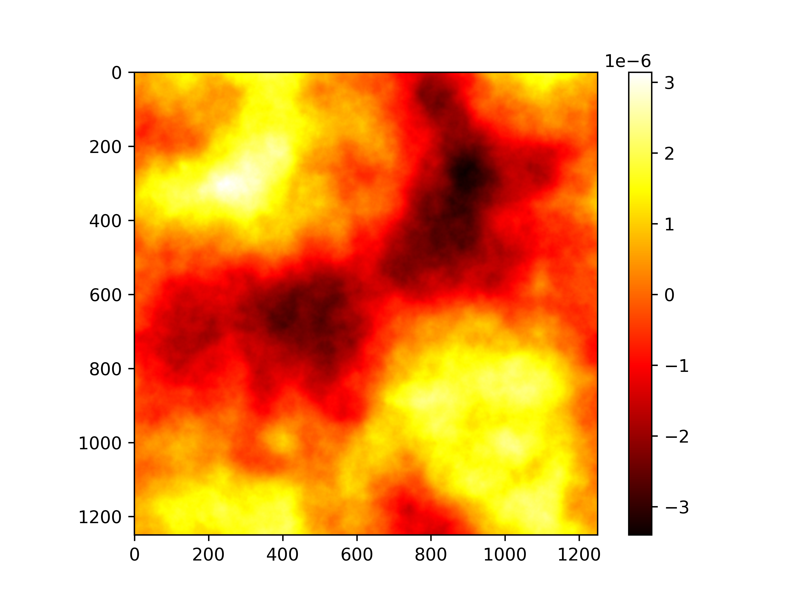

## GRAF++: Gaussian RAndom Fields in c++

A header only library for generating Gaussian Random Fields. 

Requirements:
  1. FFTW3 <br>
  debian<br>
  `sudo apt install fftw3 libfftw3-dev`
  fedora<br>
  `sudo dnf install fftw3 fftw3-dev`
  
  2. xtensor (header only)<br>
  3. xtensor-fftw (header only) <br>
  ```
  Cone with submodules enabled:
  git clone --recurse-submodules <this-repo> 
  or
  git clone <this-repo>
  git submodules init
  git submodules update
  ```

This library is built on top of xtensor arrays. xtensor-fftw in turn calls xtensor. Since submodules are already added in the repository, only fftw3 has to be installed explicitly. The implementation is a bit slow, as of now the focus is not on performance but instead integration with [hiflow3](https://emcl-gitlab.iwr.uni-heidelberg.de/hiflow3.org/hiflow3/-/wikis/home).

### Usage
```
cd src
g++ -o demo demo.cc -l fftw3
./demo
```




Values of alpha and size can be changed inside the demo.cc

##### @TODO:
    - Rewrite for KL Expansion: https://amses-journal.springeropen.com/articles/10.1186/s40323-018-0114-7
    - 
    - ~~Generate RF for mesh~~ PDE Based Sampling approach?
    - Add doxygen comments
    - Makefile
    - ini file
    - Add 2D Matern Covaraince function, Cholesky Factorization, and function for KL Decomposition
    - Fix `fftshift` loop for performance.
